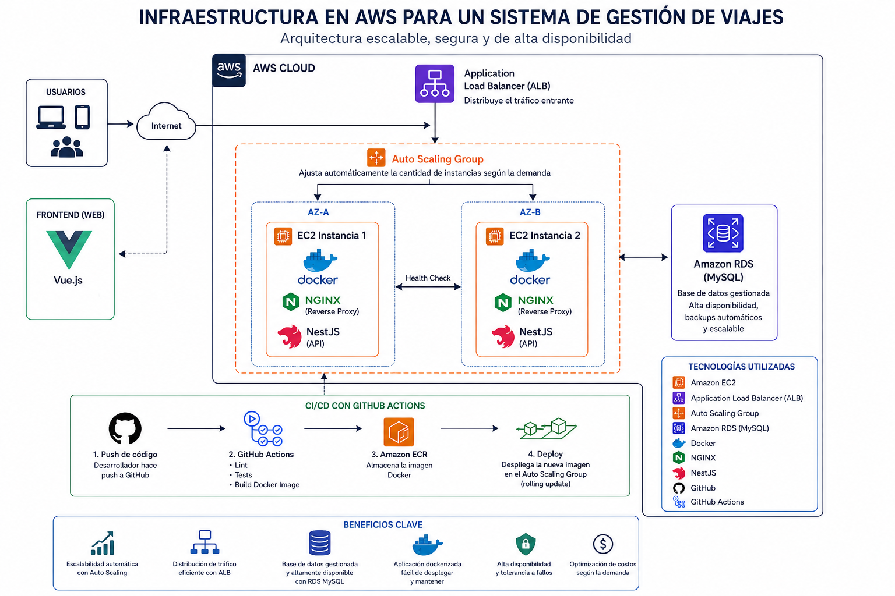
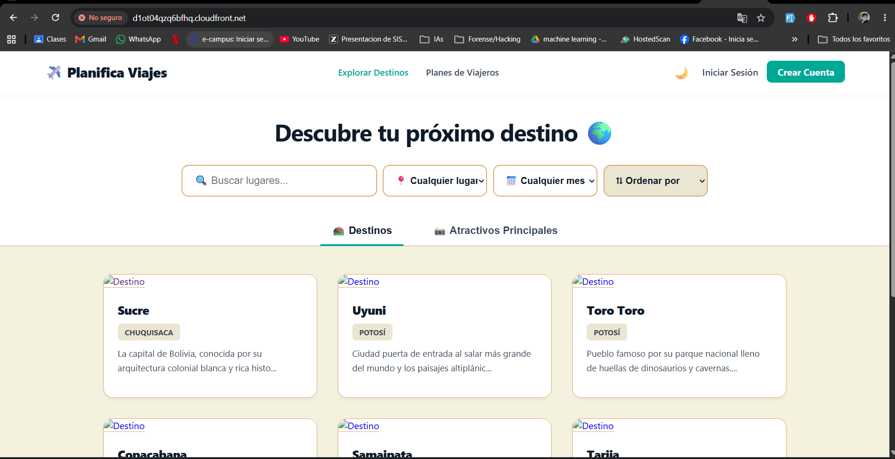
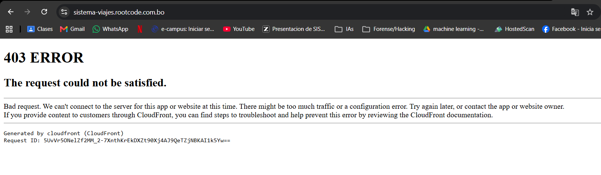
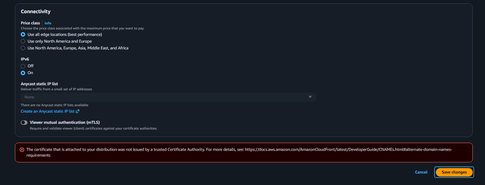
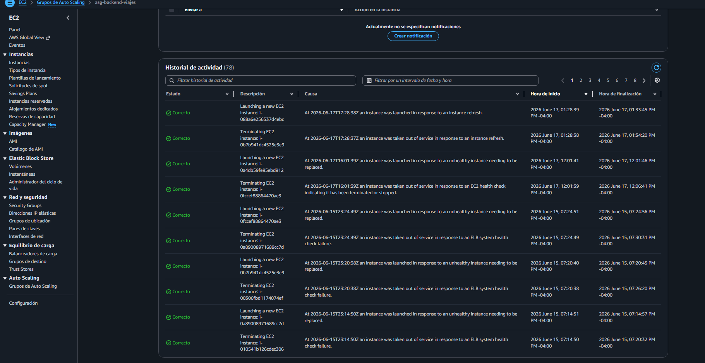
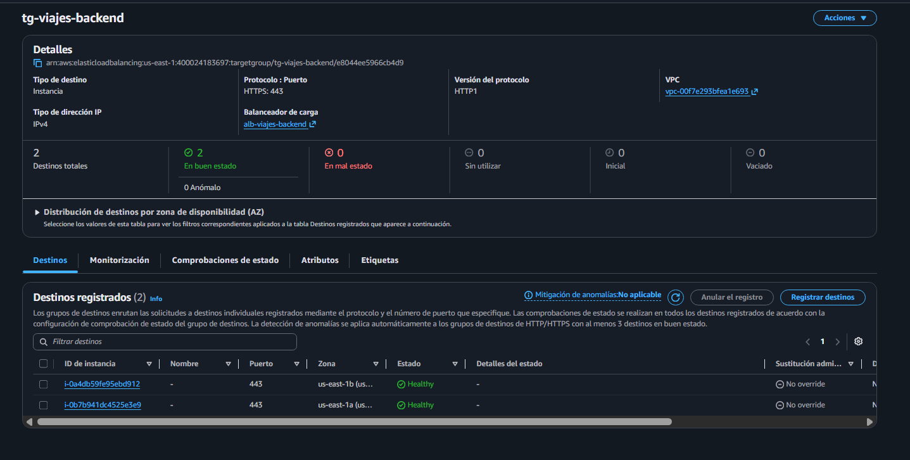
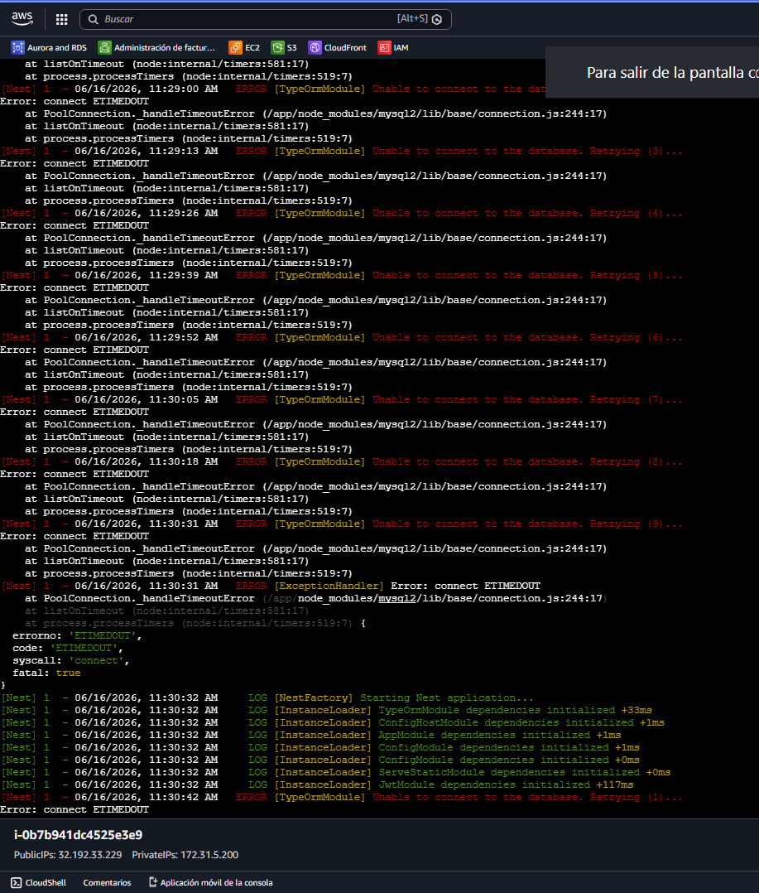
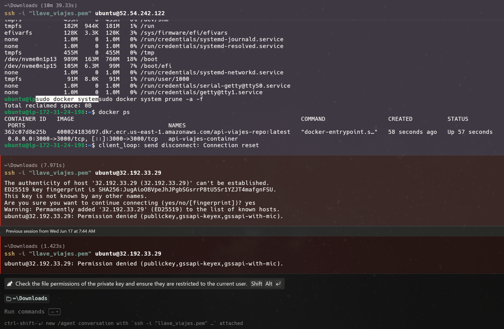
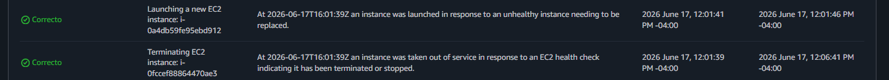

# Informe Final de Proyecto (COM610)
**Proyecto:** Sistema Web de Planificación de Viajes Económicos
**Universitario:** Josue Saygua Romero
**Carrera:** Ing. de Sistemas
**Fecha:** 17 de Junio de 2026

## 🔗 1. Enlaces a Repositorios y Despliegues
- **Backend (API NestJS):** https://github.com/Jhosua2468/Sistema-de-Planificacion-de-Viajes
- **Frontend (Vue.js):** https://github.com/Jhosua2468/Sistema-viajes-frontend
- **URL Frontend (S3 + CloudFront):** https://d1ot04qzq6bfhq.cloudfront.net/
- **URL Backend (Load Balancer AWS):** `https://alb-viajes-backend-1486483178.us-east-1.elb.amazonaws.com` 

---

## 🏗️ 2. Evolución y Estado de la Infraestructura

En la fase previa, el sistema dependía de una instancia única y ejecución manual. Para la entrega final, se implementó una arquitectura de **Alta Disponibilidad, Escalabilidad Automática y Despliegue Continuo (CI/CD)**.

| Componente / Servicio | Tecnologías Utilizadas | Estado Final |
| :--- | :--- | :--- |
| **Frontend Global** | Amazon S3 + AWS CloudFront | 🟢 Operativo |
| **Backend API** | NestJS + Docker | 🟢 Operativo |
| **Base de Datos** | Amazon RDS (MySQL) | 🟢 Operativo (Privado) |
| **Integración Continua (CI/CD)** | GitHub Actions + Amazon ECR | 🟢 Operativo |
| **Alta Disponibilidad** | AWS Auto Scaling Group (ASG) | 🟢 Operativo (Zonas us-east-1a / 1b) |
| **Balanceador de Carga** | Application Load Balancer (ALB) | 🟢 Operativo |
| **Proxy Inverso** | NGINX | 🟢 Operativo |

---

## 🚀 3. Hitos Alcanzados y Arquitectura Final

1. **Migración a Contenedores y CI/CD:** Se dockerizó la aplicación NestJS. Mediante GitHub Actions, cada `git push` compila automáticamente una nueva imagen Docker y la almacena en el repositorio privado **Amazon ECR**.
2. **Implementación de Proxy Inverso:** Se configuró **NGINX** dentro de la instancia EC2 para recibir el tráfico web seguro (puerto 443/80) y redirigirlo internamente al contenedor Docker (puerto 3000), gestionando eficazmente el certificado SSL comodín.
3. **Escalabilidad Horizontal (Auto Scaling):** Se creó una "Plantilla de Lanzamiento" (Launch Template) a partir de una AMI base. El **Auto Scaling Group** fue configurado para mantener una capacidad deseada de 2 instancias, distribuidas en diferentes zonas de disponibilidad (Multi-AZ) para tolerancia a fallos.
4. **Balanceo de Carga (ALB):** Se configuró un **Application Load Balancer** expuesto a internet que distribuye el tráfico equitativamente entre las instancias saludables del ASG.
5. **Frontend Serverless:** El código de Vue.js fue compilado y alojado en un **Bucket S3**. Se implementó **AWS CloudFront (CDN)** para distribuir el contenido globalmente con latencia mínima.

---

## 🛠️ 4. Resolución de Problemas (Troubleshooting)

### 4.1. Error de Certificado y Dominio Personalizado en CloudFront
* **Fallo:** Al intentar vincular el subdominio `sistema-viajes.rootcode.com.bo` a la distribución de CloudFront, AWS arrojó un error indicando que el certificado no era válido (Error de Autoridad Certificadora) y un error 403.
* **Diagnóstico:** Para asignar un CNAME (dominio personalizado) a CloudFront, AWS exige que se genere o importe un certificado válido en AWS Certificate Manager (ACM) en la región de *us-east-1*, y este debe validarse modificando los registros DNS del dominio. Al no tener permisos de administración sobre el dominio raíz administrado por el docente, la validación falló.
* **Solución (Workaround):** Se procedió a utilizar el dominio seguro por defecto otorgado por AWS (`https://d1ot04qzq6bfhq.cloudfront.net/`) para garantizar la accesibilidad y seguridad del frontend en la demostración.

### 4.2. Bloqueo de Conexión entre Frontend y Balanceador (CORS/SSL)
* **El Problema:** El Frontend desplegado no podía consumir la API del Balanceador de Carga, bloqueado por políticas de seguridad del navegador.
* **La Causa:** El Balanceador utiliza el certificado SSL comodín `*.rootcode.com.bo`, pero su enlace de acceso provisional pertenece al dominio `amazonaws.com`. El navegador intercepta esta diferencia de nombres como un riesgo de seguridad, bloqueando las peticiones "fetch/axios" del frontend de manera silenciosa.
* **La Solución (Provisional para Defensa):** Hasta que el docente actualice el registro CNAME del dominio para que apunte al Balanceador, es necesario realizar un "bypass" manual en el navegador. Antes de abrir el Frontend, se debe ingresar directamente a la URL del Balanceador (`https://alb-viajes-backend...`), aceptar la advertencia ("Configuración Avanzada -> Continuar al sitio no seguro") para confiar en el certificado. Una vez hecho, el Frontend consumirá la API sin problemas.

### 4.3. "Thrashing" (Ciclo de destrucción) en el Auto Scaling Group

* **Fallo:** El ASG creaba y eliminaba instancias en un bucle infinito al ser marcadas como "Unhealthy".
* **Solución:** Se editó la configuración de "Comprobaciones de Estado" en el Target Group, ajustando los *Códigos de Éxito* a un rango flexible de `200-499` y evaluando mediante HTTP (puerto 80).

### 4.4. Error 502 Bad Gateway en instancias clonadas

* **Fallo:** Las nuevas instancias clonadas daban error 502 por falta de conexión a la Base de Datos (`ETIMEDOUT` en logs de Docker).
* **Solución:** Se anexó el Grupo de Seguridad de RDS (`ec2-rds-3`) a las instancias y se actualizó la Plantilla de Lanzamiento para que los clones hereden los accesos de red a la VPC.

### 4.5. Rechazo de conexión SSH en clones ("Permission denied")

* **Fallo:** Imposibilidad de conectar vía SSH a las instancias clonadas con la llave `.pem`.
* **Solución:** Al nacer las máquinas sin llave por seguridad, se utilizó **EC2 Instance Connect** desde la consola de AWS para inyectar llaves efímeras temporales.

---

## 💥 5. Prueba de Alta Disponibilidad (Terminación de Instancia)
* **Simulación:** Se forzó la "caída" del sistema simulando un fallo crítico en el servidor, seleccionando una de las instancias en ejecución en EC2 y utilizando la acción "Terminar Instancia".
* **Resultado:** El Target Group detectó la pérdida de conexión y el Auto Scaling Group entró en acción de inmediato. Al detectar que la capacidad actual era de 1 instancia (menor a la deseada de 2), procedió a aprovisionar e inicializar automáticamente una nueva instancia de reemplazo para mantener la disponibilidad.

---

## ⚙️ 6. Consideraciones Actuales y Trabajo Futuro (Mejora Continua)

El sistema base se encuentra en producción, destacando como punto fuerte la **Alta Tolerancia a Fallos** lograda con el ASG y el Balanceador. Como trabajo futuro de refactorización se plantea:

1. **Gestión de Archivos Estáticos (Almacenamiento Stateless):** Actualmente, las imágenes subidas desde el sistema de administrador se almacenan temporalmente en los volúmenes físicos (EBS) de las instancias, lo que representa una inconsistencia frente a una arquitectura efímera. Como próxima iteración se refactorizará el módulo `DestinosService` en NestJS para integrar el **SDK de AWS S3**, asegurando que el contenido multimedia persista en la nube sin depender del tiempo de vida de los contenedores Docker locales.

2. **Apunte Final del DNS:** La arquitectura está lista para recibir tráfico desde el dominio oficial. Se requiere actualizar el registro CNAME en Cloudflare para que `api-sistema-viajes.rootcode.com.bo` apunte al DNS del Balanceador de Carga, eliminando la necesidad temporal de forzar la aceptación del certificado SSL comodín en el navegador.

